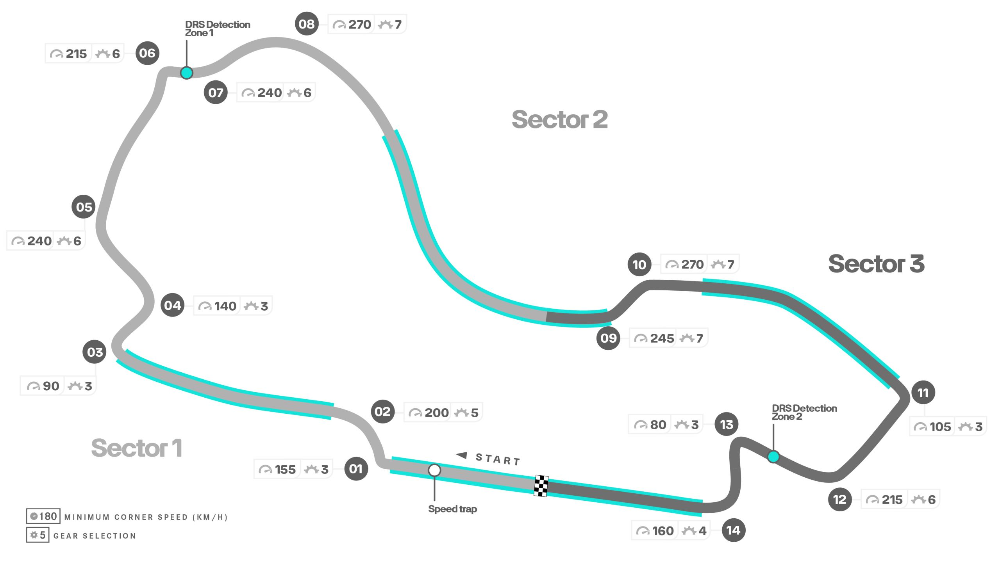
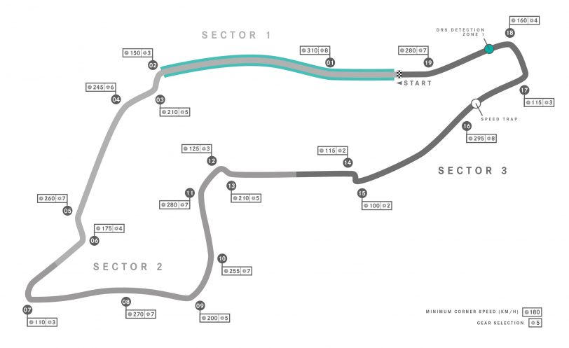

# F1
> “It is something for me which is absolutely fine as long as I am standing on the top... To me, the most important thing is I take the trophy home and they go back to their houses and they can... have a nice evening” - Max Verstappen

- Author: [Kintsugi-Programmer](https://github.com/kintsugi-programmer)

> Disclaimer: The content presented here is a curated blend of my personal learning journey, experiences, open-source documentation, and invaluable knowledge gained from diverse sources. I do not claim sole ownership over all the material; this is a community-driven effort to learn, share, and grow together.

## Table of Contents
- [F1](#f1)
  - [Table of Contents](#table-of-contents)
  - [Formula 1 Circuit Maps](#formula-1-circuit-maps)
    - [Albert Park Circuit | Australian Grand Prix](#albert-park-circuit--australian-grand-prix)
    - [Autodromo Enzo e Dino Ferrari | Emilia Romagna Grand Prix](#autodromo-enzo-e-dino-ferrari--emilia-romagna-grand-prix)
  - [The F1 Grand Prix Weekend Format](#the-f1-grand-prix-weekend-format)
  - [Race Details, Duration, and Scoring](#race-details-duration-and-scoring)
  - [Sprint Race Weekends](#sprint-race-weekends)
  - [The Race Start Procedure](#the-race-start-procedure)
  - [Visual Communication: The F1 Flags](#visual-communication-the-f1-flags)
  - [Race Neutralization: Safety Cars](#race-neutralization-safety-cars)
  - [Why i F1](#why-i-f1)
  - [References](#references)

## Formula 1 Circuit Maps

### Albert Park Circuit | Australian Grand Prix
- First Grand Prix: 1996
= Number of Laps: 58
- Circuit Length: 5.278km
- Race Distance: 306.124 km
- Lap Record: 1:20.235 Sergio Perez (2023)

### Autodromo Enzo e Dino Ferrari | Emilia Romagna Grand Prix

- First Grand Prix: 1980
- Number of Laps: 63
- Circuit Length: 4.909km
- Race Distance: 309.049 km
- Lap Record: 1:15.484: Lewis Hamilton (2020)

## The F1 Grand Prix Weekend Format

A traditional Formula 1 (F1) Grand Prix is a festival of excitement and entertainment that typically spans three to four days, culminating in the main race.

**1. Practice Sessions**
The weekend begins with **free practice sessions** over a couple of days before race day. These sessions allow drivers and teams to:
*   Learn the track.
*   Experiment with conditions.
*   Test different setups and configurations they plan to use in qualifying and the race.

**2. Qualifying**
Following practice, the competitive element begins with qualifying. This is where drivers attempt to set the **fastest possible lap times** across three knockout sessions: Q1, Q2, and Q3.
*   The driver who survives all Knockouts and sets the fastest time starts the race from the front of the grid, known as **Pole Position**.
*   The remaining starting positions for the race are ordered based on the qualifying lap times set by the other drivers.

## Race Details, Duration, and Scoring

**Race Duration**
The duration of an F1 race is decided by a simple calculation.
*   A Grand Prix distance is fixed at **305 km**.
*   This distance is divided by the length of a single lap and then rounded up to a whole number to determine the number of laps for the race.
*   The only exception is if stoppages cause the race to run over a **2-hour time limit**.

**Scoring and Points**
Championship points are awarded to all drivers who finish in the top 10 at the end of the race.
*   First place receives **25 points**.
*   Tenth place receives one single point.
*   An **extra point** is awarded if a driver sets the fastest lap of the race, but only if that driver finishes inside the top 10. Drivers outside the top 10 do not receive any points, even if they set the fastest lap.

## Sprint Race Weekends

A few times per season, F1 uses a modified format called the **Sprint race weekend** at predetermined races on the calendar. This format differs from the traditional Grand Prix structure:
*   Teams only have **one practice session** before the competitive elements begin.
*   The reduced practice time makes way for two high-tempo sessions: **Sprint qualifying** and the **F1 Sprint**.
*   Sprint qualifying determines the grid order for Saturday’s shorter F1 Sprint race.
*   The F1 Sprint is a shorter distance race designed to be run with **no mandatory pit stops**.
*   The Sprint offers **extra points** that can be crucial in a tight championship. Only the **top eight finishers** in the Sprint receive points, and the points awarded are fewer than in the main race.

## The Race Start Procedure

Getting an F1 race started successfully requires many moving parts and roles to work in harmony.

1.  **Grid Preparation:** Cars are moved from the garages to the grid about 40 to 50 minutes before the race. Drivers place their cars into their determined grid slots, which were decided by the qualifying results. Mechanics and engineers maintain the cars while they sit on the grid.
2.  **Formation Lap:** Once the start time approaches, the teams and crew return to the garage, and the cars start up. This begins the formation lap, which is a reduced-speed tour around the circuit. The formation lap allows drivers to check all systems, examine track conditions, and crucially, **warm up their tires and brakes**. F1 cars perform best when these components are at the correct temperature. During this lap, cars drive on the racing line in single file, avoiding dust on the dirtier sides of the track.
3.  **The Start:** After the cars return to their correct starting positions, a green flag is waved at the back of the grid to signal readiness. Attention then shifts to the start lights above the start/finish line.
    *   **Five red lights** come on one by one.
    *   The race officially begins when those lights go out. Historically, green lights were used to signal the start, but they were removed because drivers learned they could react faster to the red lights extinguishing than waiting for the green lights to come on.
4.  **Aborted Starts:** A race start may be aborted for various reasons, such as a car breaking down on the grid, a technical issue with the lights or timing equipment, or a drastic change in weather. If a start is aborted, the cars slowly lap the circuit, and no overtaking is allowed.

## Visual Communication: The F1 Flags

F1 uses flags as the quickest, simplest, and easiest form of communication to relay key messages to all 20 drivers visually as they travel at high speed. This system is supported by trackside electronic boards and displays on the drivers' steering wheels.

| Flag Type | Meaning and Action Required |
| :--- | :--- |
| **Yellow Flag (Single Waved)** | An incident is in the section of the track ahead. Drivers must reduce speed, be prepared to navigate a hazard, and **no overtaking is allowed**. |
| **Double Waved Yellow Flag** | Drivers must reduce speed significantly or be ready to stop due to a blockage or Marshalls on or beside the track. If waved during qualifying, drivers must abandon their current lap and visibly demonstrate they have slowed down. |
| **Full Course Yellow (FCY)** | Imposed by the Race Director, meaning yellow flag rules apply to the **entirety of the track** until further notice. |
| **Yellow Flag with Red Stripes** | Indicates a significant reduction in grip ahead, possibly due to oil spillage or excess water. |
| **Green Flag** | Signals that the track is clear to go racing; follows a yellow flag once the issue is resolved. |
| **Red Flag** | The circuit is deemed temporarily unsafe or unraceable. Drivers must slow down immediately, prepare to stop, and return slowly and carefully to the pit lane with **no overtaking**. The race is neutralized, preserving current race positions. |
| **Blue Flag (Practice/Qualifying)** | Indicates that faster cars are approaching or the driver is leaving the pit lane. |
| **Blue Flag (Race)** | Indicates that the driver is about to be lapped. The driver must allow the approaching car(s) to pass at the earliest opportunity. |
| **Black and White Flag** | Used for unsportsmanlike behavior, overly aggressive or unsafe driving, but most commonly for **exceeding track limits**. This serves as the driver's final warning before incurring a time penalty. |
| **Black Flag with Orange Dot (Meatball Flag)** | Warns a driver that their car has damage and they **must return to the pits for repairs**. Failure to enter the pit will result in severe penalties. |
| **Full Black Flag** | Signals that the driver is **disqualified** and must return to the pits immediately. Causes can include on-track behavior or a technical infringement by the team. |
| **Checkered Flag** | In practice and qualifying, it signals that time is up. In the race, it signals glory and is waved at the finish line to the driver who completes the race distance first. |

## Race Neutralization: Safety Cars

When an incident is too serious to be handled solely by the flag system, the Race Director may deploy a safety car.

**1. Safety Car (SC)**
*   The SC enters the circuit from the pit lane.
*   The car in first place must follow the SC at a reduced speed, and the rest of the pack follows behind.
*   **No overtaking is permitted** under safety car conditions. Drivers must maintain approximately the same speed as the car ahead to keep the pack tight and moving slowly while incidents are cleared.
*   When the incident is cleared, the SC returns to the pits. The leading car then controls and dictates the pace of the rest of the pack.
*   Overtaking is forbidden until the car passes the **safety car line** (a white line usually at the beginning of the start/finish straight), creating a tense and strategic restart.

**2. Virtual Safety Car (VSC)**
The VSC is another method used by the Race Director to neutralize the race when an incident occurs.
*   The VSC is used for situations that do not warrant a full safety car but require more action than double waved yellow flags.
*   It applies to the whole circuit and limits drivers to a **set slower, variable speed limit and lap time**.
*   The primary benefit of the VSC is that it **preserves the gaps between cars**. If a full safety car were used, a leading driver's substantial lead would be erased as all cars are required to line up single file behind the SC. Under VSC, all drivers are capped to the same minimum lap time without a physical safety car on track, meaning the gaps are more or less preserved.

## Why i F1
- I just love the Racing Games
- F1 is Engineering Marvel
- the joy of Speed Thrill and Simphony of Combinations of Gears, Brakes, Acceleration, Steering, Forsee & Planning, Maps
- It just feels cool
- also would love to Drive at actual Simulation Setup in future
- For that Great Experience ,i am just gaining knowledge of F1
- Hunger of Knowledge

## References
- https://f1chronicle.com/formula-1-circuit-maps/
- https://www.youtube.com/watch?v=zYpKWBXhcik

---
End-of-File

The [KintsugiStack](https://github.com/kintsugi-programmer/KintsugiStack) repository, authored by Kintsugi-Programmer, is less a comprehensive resource and more an Artifact of Continuous Research and Deep Inquiry into Computer Science and Software Engineering. It serves as a transparent ledger of the author's relentless pursuit of mastery, from the foundational algorithms to modern full-stack implementation.

> Made with 💚 [Kintsugi-Programmer](https://github.com/kintsugi-programmer)