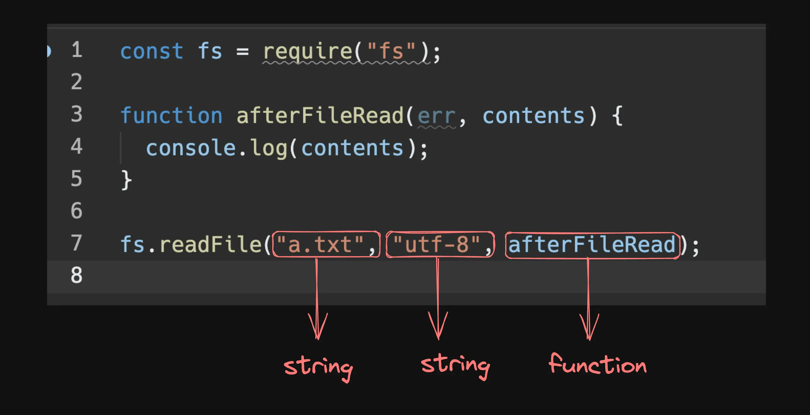
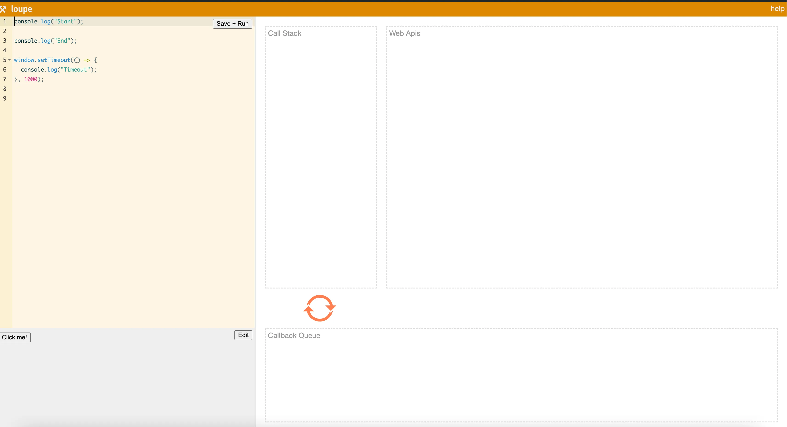

# fullstack-webdev-essentials
## Asynchronous Javascript, Callbacks and more

### Intro
- Goal of todays class:
  - I/O tasks
  - Callbacks
  - Functional arguments
  - Async vs Sync codeEvent loops, callback queues, JS
  - Goal of tomorrows class
  - Async await, Promises
  - Practising async JS
 
Hopefully, by the end of the class, you are able to understand the following code:

- Functional arguments

```js
function sum(a, b) {
  return a + b;
}

function multiply(a, b) {
  return a * b;
}

function subtract(a, b) {
  return a - b;
}

function divide(a, b) {
  return a / b;
}

function doOperation(a, b, op) {
  return op(a, b)
}

console.log(doOperation(1, 2, sum))
```
- Callbacks
```js
const fs = require("fs");

fs.readFile("a.txt", "utf-8", function (err, contents) {
  console.log(contents);
});
```

### Normal functions in JS
The way to write functions in JS is as follows - 
Find sum of two numbers
```js
function sum(a, b) {
	return a + b;
}

let ans = sum(2, 3)
console.log(sum);
```
 
Find sum from 1 to a number
```js
function sum(n) {
	let ans = 0;
	for (let i = 1; i <= n; i++) {
		ans = ans + i
	}
	return ans;
}

const ans = sum(100);
console.log(ans);
```

### Synchronous code
Synchronous code is executed line by line, in the order it's written. Each operation waits for the previous one to complete before moving on to the next one.

For example
```js
function sum(n) {
	let ans = 0;
	for (let i = 1; i <= n; i++) {
		ans = ans + i
	}
	return ans;
}

const ans1 = sum(100);
console.log(ans1);
const ans2 = sum(1000);
console.log(ans2);
const ans3 = sum(10000);
console.log(ans3);
```

### I/O heavy operations

I/O (Input/Output) heavy operations refer to tasks in a computer program that involve a lot of data transfer between the program and external systems or devices. These operations usually require waiting for data to be read from or written to sources like disks, networks, databases, or other external devices, which can be time-consuming compared to in-memory computations.

- Examples of I/O Heavy Operations:
  - Reading a file
  - Starting a clock
  - HTTP Requests
 
> 💡 We’re going to introduce imports/requires next. A require statement lets you import code/functions export from another file/module.
 
Let’s try to write code to do an I/O heavy operation - 
- Open repl.it
- Create a file in there (a.txt) with some text inside
- Write the code to read a file synchronously
```js
const fs = require("fs");

const contents = fs.readFileSync("a.txt", "utf-8");
console.log(contents);
```
- Create another file (b.txt)
- Write the code to read the other file synchronously
```js
const fs = require("fs");

const contents = fs.readFileSync("a.txt", "utf-8");
console.log(contents);

const contents2 = fs.readFileSync("b.txt", "utf-8");
console.log(contents2);
```
> 💡What is wrong in this code above?

### I/O bound tasks vs CPU bound tasks
- CPU bound tasks

CPU-bound tasks are operations that are limited by the speed and power of the CPU. These tasks require significant computation and processing power, meaning that the performance bottleneck is the CPU itself.
```js
let ans = 0;
for (let i = 1; i <= 1000000; i++) {
	ans = ans + i
}
console.log(ans);	
```
> 💡A real world example of a CPU intensive task is running for 3 miles. Your legs/brain have to constantly be engaged for 3 miles while you run.

- I/O bound tasks

I/O-bound tasks are operations that are limited by the system’s input/output capabilities, such as disk I/O, network I/O, or any other form of data transfer. These tasks spend most of their time waiting for I/O operations to complete.
```js
const fs = require("fs");

const contents = fs.readFileSync("a.txt", "utf-8");
console.log(contents);
```
> 💡 A real world example of an I/O bound task would be Boiling water. I don’t have to do much, I just have to put the water on the kettle, and my brain can be occupied elsewhere.

### Doing I/O bound tasks in the real world
What if you were tasked with doing 3 things
- Boil some water.
- Do some laundry
- Send a package via mail

Would you do these 
- One by one (synchronously)
- Context switch between them (Concurrently)
- Start all 3 tasks together, and wait for them to finish. The first one that finishes gets catered to first.
 
> 💡Good talk - Concurrency is not parallelism  - https://www.youtube.com/watch?v=oV9rvDllKEg

- Synchronously (One by one)
```js
const fs = require("fs");

const contents = fs.readFileSync("a.txt", "utf-8");
console.log(contents);

const contents2 = fs.readFileSync("b.txt", "utf-8");
console.log(contents2);

const contents3 = fs.readFileSync("b.txt", "utf-8");
console.log(contents3);
```

- Start all 3 tasks together, and wait for them to finish.
```js
const fs = require("fs");

fs.readFile("a.txt", "utf-8", function (err, contents) {
  console.log(contents);
});

fs.readFile("b.txt", "utf-8", function (err, contents) {
  console.log(contents);
});

fs.readFile("a.txt", "utf-8", function (err, contents) {
  console.log(contents);
});

```

### Functional arguments
Write a calculator program that adds, subtracts, multiplies, divides two arguments.
- Approach #1
- Calling the respective function
```js
function sum(a, b) {
  return a + b;
}

function multiply(a, b) {
  return a * b;
}

function subtract(a, b) {
  return a - b;
}

function divide(a, b) {
  return a / b;
}

function doOperation(a, b, op) {
  return op(a, b)
}

console.log(sum(1, 2))
```
- Approach #2
- Passing in what needs to be done as an argument.
```js
function sum(a, b) {
  return a + b;
}

function multiply(a, b) {
  return a * b;
}

function subtract(a, b) {
  return a - b;
}

function divide(a, b) {
  return a / b;
}

function doOperation(a, b, op) {
  return op(a, b)
}

console.log(doOperation(1, 2, sum))
```

### Asynchronous code, callbacks
Let’s look at the code to read from a file asynchronously. Here, we pass in a function as an argument. This function is called a callback since the function gets called back when the file is read 

```js
const fs = require("fs");

fs.readFile("a.txt", "utf-8", function (err, contents) {
  console.log(contents);
});
```
- setTimeout
- setTimeout is another asynchronous function that executes a certain code after some time
```js
function run() {
	console.log("I will run after 1s");
}

setTimeout(run, 1000);
console.log("I will run immedietely");
```

### JS Architecture for async code
How JS executes asynchronous code - http://latentflip.com/loupe/

- 1. Call Stack
  - The call stack is a data structure that keeps track of the function calls in your program. It operates in a "Last In, First Out" (LIFO) manner, meaning the last function that was called is the first one to be executed and removed from the stack.
  - When a function is called, it gets pushed onto the call stack. When the function completes, it's popped off the stack.
```js
function first() {
  console.log("First");
}
function second() {
  first();
  console.log("Second");
}
second();
```
- 2. Web APIs
  - Web APIs are provided by the browser (or the Node.js runtime) and allow you to perform tasks that are outside the scope of the JavaScript language itself, such as making network requests, setting timers, or handling DOM events.
- 3. Callback Queue 
  - The callback queue is a list of tasks (callbacks) that are waiting to be executed once the call stack is empty. These tasks are added to the queue by Web APIs after they have completed their operation.
- 4. Event loop
  - The event loop constantly checks if the call stack is empty. If it is, and there are callbacks in the callback queue, it will push the first callback from the queue onto the call stack for execution.
 

## Promises and async, await
`Aaj ghode khuleinge.`


What we’re doing today
- Classes in JS
- Revise callbacks
- Callback hell
- Promises
- Async await
- Assignments
- Will release a video on how to solve them
- https://github.com/100xdevs-cohort-3/assignments/


## Classes in JS
- Primitive types
  - number
  - string
  - boolean
 
- Complex types
  - Objects
  - Arrays
 
- Classes
- In JavaScript, classes are a way to define blueprints for creating objects (these objects are different from the objects defined in the last section).
- For example
```js
class Rectangle {
   constructor(width, height, color) {
	    this.width = width;
	    this.height = height;
	    this.color = color; 
   }
   
   area() {
	   const area = this.width * this.height;
		 return area;
   }
   
   paint() {
			console.log(`Painting with color ${this.color}`);
   }
   
}

const rect = new Rectangle(2, 4)
const area = rect.area();
console.log(area)
```
- Key Concepts
- Class Declaration:
  - You declare a class using the class keyword.
  - Inside a class, you define properties (variables) and methods (functions) that will belong to the objects created from this class.
- Constructor:
  - A special method inside the class that is called when you create an instance (an object) of the class.
  - It’s used to initialize the properties of the object.
- Methods:
  - Functions that are defined inside the class and can be used by all instances of the class.
- Inheritance:
  - Classes can inherit properties and methods from other classes, allowing you to create a new class based on an existing one.
- Static Methods:
  - Methods that belong to the class itself, not to instances of the class. You call them directly on the class.
- Getters and Setters:
  - Special methods that allow you to define how properties are accessed and modified.
 